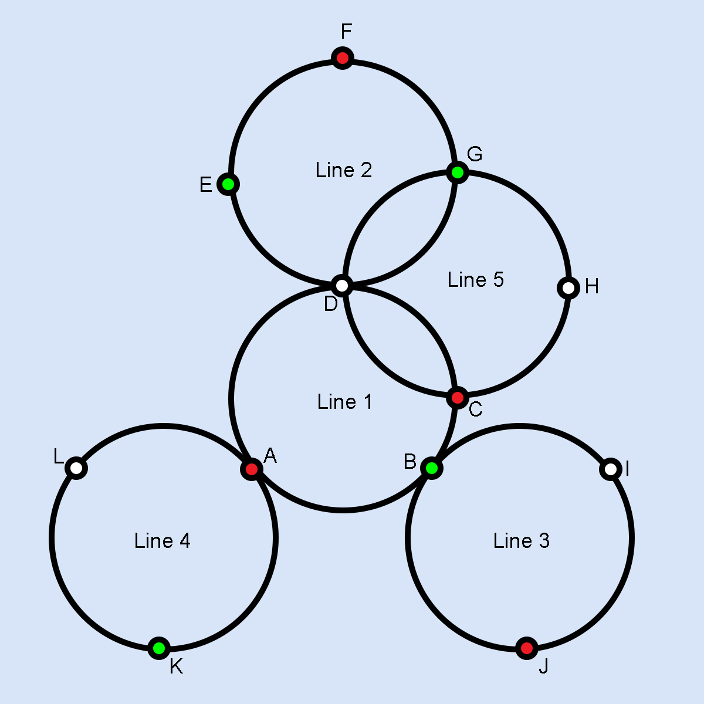

# 
 **What is this project?**
We seeks to implement a search algorithm for the shortest route between two points for a train/metro network. An automatic Test Case testing system is also implemented. To solve the problem, the class [PathSolver.py](PathSolver.py) and the script [main.py](main.py) are created, both programmed in Python. The files [network.csv](network.csv) and [TestCases.csv](TestCases.csv) are also used to populate the PathSolver object and our Test Cases respectively. In other words we find the shortest path for a network that mutates based on so called "Train Colors", hence why we name the project "Conditional Shortest Path"
## 
 **Network Generation**
An adjacency list is used to model the metro network to be analyzed. In this way, the PathSolver object contains a dictionary where the key of each entry corresponds to the name of the station (In this case, a unique name with a single letter, sensitive to capital letters is assumed) containing the entries "COLOR", "LINES" and "NEIGHBOURS".
>1. "COLOR": This input can contain the strings "WHITE", "RED" or "GREEN" depending on the color of the station. A Red train can stop only at red and white stops, a green train can only stop at green and white stops and a white train can stop at any stop.
>2. "LINES": Contains a list containing all the lines to which the station belongs. We implement this to consider that a train cannot change paths at a station it did not stop at.
>3. "NEIGHBORS": Contains a list of all adjacent station names.

These are contained in [network.csv](network.csv) as an example and are filled in as follows: Each row contains strings of the form "AAAA","BBBB","####","CCCC" where AAAA is a string with the name of one of the stations, BBBB is a string that indicates its color, #### is a string that indicates the lines to which this station belongs. separated by commas and CCCC indicates the name of all neighboring stations separated by commas.
As an example:
>LineaMetro["A"]["Lines"] returns the list containing all the lines to which station A belongs

Alternativelly the constructor can be called with no argument and populated later using the method self.fillFromDict(DICT) where DICT is a dictionary which follows the aforementioned format.

In this case, the file [network.csv](network.csv) corresponds to the representation of the following diagram:

## 
 **Algorithm**
To find the shortest path between stations "A" and "B" using a colored train "COLOR" the function **self.Shortestpath(A,B,COLOR)** is called where self indicates the name of the instance of the PathSolver object.
The ShortestPath function returns the shortest path between the neighbors of A and B using a train of COLOR color, maintaining the following logic. Initially, the DFS algorithm is executed on A, using the path (A,B,+) for each line of A "+". **DFS()** if the start node is a stop, adding it to the string of **visited[0]** otherwise to **visited[1]**, then search recursively for shortest path between all neighboring nodes using the following logic.
>- If A was already a visited stop, an empty string is returned.
>- If A was a station where it stops, it goes to visit all the neighbors on all the routes where the line is shared, otherwise it only goes to a neighbor on the same line, following this same line.
>- Finding that the start node is equal to the end node, return **visited[0]** which contains all previous stops for this path.
>
The helper function **shortestAnswer()** receives a list with different paths, to return only the shortest of the non-empty responses. In case they are all empty, the path "" is returned.
## 
 **Test Cases**
To implement the use of Automatic Testing, the file [TestCases.csv](TestCases.csv) is used, which contains the "Input" and "Output" columns.
>"Input": Contains a String of the form "AAA,BBB,CCC" where AAA corresponds to the initial station, BBB to the final station and CCC to the color of the train.

>"Output": Contains a String that corresponds to all acceptable solutions of the Input, separated by commas.

The main script then takes these Test Cases and executes **shortestPath** for each one, displaying the console results in red if rejected or green if accepted.For this the library colorama is used.
In this case the file provided corresponds to a list of cases for the example network given as an example. The chosen cases propose edge cases such as:
- Start station is inside the route, but the train does not stop here.
- Route from a station to itself
- Route between two disconnected stations due to the color of the train.
- long route
- short route
- Initial stop color is different from the arrival color
- Route without beginning or without end.

## 
 **Example Code**
>import PathSolver
> 
> p=PathSolver("network.csv")  
> print(p.shortestPath("L","H","WHITE"))
> 
> _____
>Output:
> 
> LABCH

## 
 **Final Thoughts**
When addressing this problem, certain assumptions are made, such as:
1. The values of network and TestCases are sanitized and are assumed to follow proper format.
2. A train that starts at a station where it does not stop returns the route to the destination without including the start stop, this could be an unexpected result if one expects this to be an invalid route.
3. The metro network has an appropriate size to return a result in an appropriate time, taking into account that this algorithm has a time complexity O(n^2), for larger networks a caché can be implemented at the cost of memory.
4. [main.py](main.py) Isn't needed to run this program, but is here to implement test cases
